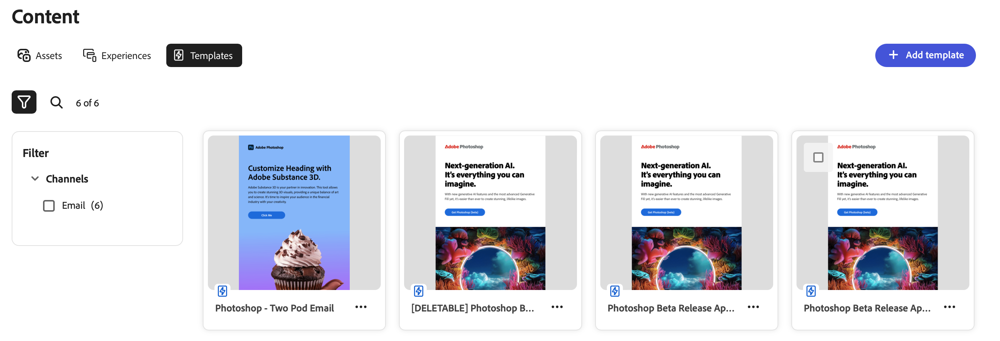

# Trabalhar com modelos

O GenStudio for Performance Marketing permite que os criadores de conteúdo produzam conteúdo de marketing consistente na marca rapidamente usando _modelos_. Um modelo reduz significativamente o tempo e o esforço necessários para gerar novo conteúdo, fornecendo um ponto de partida que inclui layouts pré-configurados e elementos de design.

## Elementos do modelo

Um modelo é um conjunto de instruções definidas com o HTML e o CSS em linha que podem ser usadas para produzir uma experiência de email ou de meta-anúncio.

Veja a seguir uma lista dos elementos usados em templates e alguns detalhes sobre suas características.

- **Pré-cabeçalho**

   - Atua como uma linha de assunto secundária em um email, aprimorando a linha de assunto principal
   - Entre 40 e 50 caracteres
   - Visível na caixa de entrada ao lado do assunto antes que o email seja aberto
   - Usado em modelos de email

- **Cabeçalho**

   - Seção superior do email que o destinatário vê ao abrir o email
   - Define o tom e fornece o contexto para o conteúdo incluído
   - Usado em modelos de email

- **Título**

   - Primeiro conteúdo que o recipient vê
   - Deve ser convincente para capturar interesse
   - Usado em modelos de metadados

- **Corpo**

   - Área de conteúdo principal onde a mensagem principal é transmitida
   - Capaz de incluir texto, imagens e outras mídias
   - Usado em modelos de email e de meta-anúncios

- **CTA (Plano de ação)**

   - Incentiva o recipient a realizar uma ação específica, como clicar em um link ou fazer uma compra
   - Usado em modelos de email e de meta-anúncios

- **Imagens**

   - Aprimora o apelo visual
   - Dividir texto
   - Dar suporte à mensagem
   - Deve ser de alta qualidade e atraente
   - Usado em modelos de email e de meta-anúncios

- **Rodapé**

   - Seção inferior que contém conteúdo adicional, como detalhes do contato, links de redes sociais, avisos de isenção de responsabilidade e opções de cancelamento de inscrição
   - Usado em modelos de email

- **Sobreposição de Texto**

   - Texto em uma imagem
   - Use para suportar e aprimorar o título e o corpo
   - Usado em modelos de metadados

>[!TIP]
>
>Consulte os [nomes de campo reconhecidos](customize-template.md#recognized-field-names) aceitos pelo GenStudio for Performance Marketing para modelos de cada tipo de Canal.

## Configurar diretrizes do canal

É uma prática recomendada configurar as [diretrizes do canal](../guidelines/brands.md#channel-guidelines) para cada marca antes de usar os modelos no GenStudio for Performance Marketing. As diretrizes de canal influenciam diretamente o tipo de conteúdo gerado ao usar o template. Por exemplo, você pode definir limites de caracteres no corpo de um email.

## Personalizar modelo

Você [personaliza seu modelo](customize-template.md) para uso no GenStudio for Performance Marketing inserindo espaços reservados para conteúdo, ou campos, que a IA geradora usa para inserir conteúdo. O GenStudio for Performance Marketing reconhece determinados campos, como o campo `body`, e segue as diretrizes de canal configuradas para a marca selecionada.

>[!TIP]
>
>Siga as [diretrizes de acessibilidade para criar modelos](accessibility-for-templates.md) de forma que você possa alcançar mais de seu público-alvo e fornecer uma experiência ideal.

## Fazer upload de um modelo

Use [Personalizar modelos](customize-template.md) como guia ao preparar um modelo para o GenStudio for Performance Marketing. Consulte as [diretrizes de acessibilidade para modelos](accessibility-for-templates.md) para obter orientação sobre como fornecer uma experiência melhor para todos os públicos-alvo.

**Para adicionar um modelo**:

1. Em _[!DNL Content]_, selecione a seção **[!UICONTROL Modelos]**.

1. Clique em **[!UICONTROL Adicionar modelo]**.

1. No painel _[!UICONTROL Adicionar modelo aprovado]_, procure o arquivo de modelo de HTML ou arraste o arquivo de modelo de HTML para soltar espaço. Clique em **[!UICONTROL Avançar]**.

1. No painel _[!UICONTROL Revisar campos descobertos]_, reveja os campos detectados. Verifique se você está usando o modelo correto e se todos os detalhes estão conforme esperado. Clique em **[!UICONTROL Avançar]**.

   Exemplo de visualização para um modelo de email:

   {width="650"}

   >[!TIP]
   >
   >Se o modelo não estiver correto, clique em **[!UICONTROL Voltar]** e retorne à etapa anterior. Faça upload do arquivo de modelo corrigido.

1. No painel _[!UICONTROL Fornecer detalhes do modelo e carregar]_, nomeie o modelo e selecione um tipo de **[!UICONTROL Canal]**.

   O nome do modelo e o tipo de canal são obrigatórios. Os requisitos adicionais podem incluir:

   - **Meta**: requer taxa de proporção
   <!-- - **Display ads**: requires Dimensions -->

1. Adicione quantos detalhes forem possíveis para melhorar a identificação do modelo em pesquisas e filtragem.

1. Clique em **[!UICONTROL Concluído]**.

## Criar com um modelo

Encontre e use um modelo existente no GenStudio for Performance Marketing para criar mais experiências.

**Para criar uma experiência com um modelo**:

1. Em _[!DNL Content]_, selecione a seção **[!UICONTROL Modelos]**.

   {width="650" zoomable="yes"}

1. Selecione um modelo para obter uma exibição completa e uma lista de detalhes.

1. Clique em **[!UICONTROL Criar experiência]** (pincel) no canto superior direito para usar o modelo.

1. Continue com os [tutoriais](/help/tutorials/tutorials.md) para criar uma experiência.
